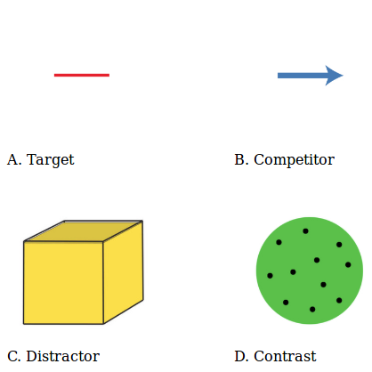
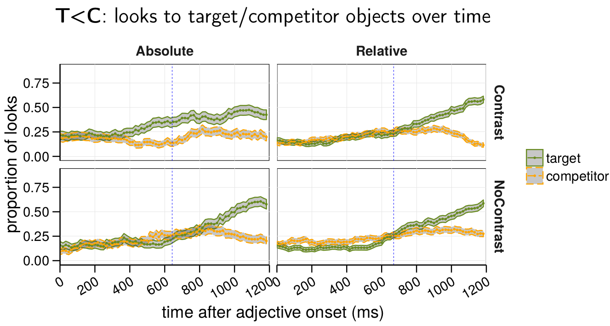
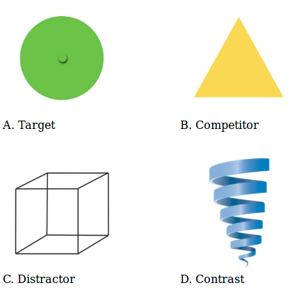

```{r setup, include=FALSE}
options(htmltools.dir.version = FALSE)


library(tidyverse)
library(forcats)
library(scales)
library(knitr)
source("../linking_hypothesis/rscripts/helpers.R")

df <- read.csv("eyeclickdata.csv") 
```

class: center, middle, title-slide

# What do proportions of look in visual world studies tell us?


### Ciyang Qing

<br />

### Alps lab meeting

#### November 17, 2017

---
# Visual world studies

- Demo

--

- One common dependent measure: proportions of looks in a certain time window after the onset of the critical stimuli

--

- Hidden linking assumption: proportion of looks reflects people's belief about the intended referent

.footnote[(E.g., Sedivy, Tanenhaus, Chambers & Carlson 1999; Leffel, Xiang & Kennedy 2016)]


--

- What if we explicitly test it?


---

# Offline incremental decision task

- 100 participants recruited via Amazon Mechanical Turk

- Same visual displays from Leffel, Xiang & Kennedy 2016 

- Critical sentence: "**Please click on the [adj] [noun]**"


---

# Click data: Prior

After "please click on the"

```{r, echo=FALSE}
df.prior <- df %>% filter(Window == "prior")

tb.prior <- 
  df.prior %>% 
  group_by(condition, Region) %>%
  summarise(n = sum(freq.click)) %>%
  spread(condition, n) %>%
  mutate(p.contrast = contrast / sum(contrast), 
         p.nocontrast = nocontrast / sum(contrast)) %>%
  rename(n.contrast = contrast, n.nocontrast = nocontrast)

knitr::kable(tb.prior, format = 'html')

chisq.contrast <- chisq.test(tb.prior$n.contrast)
chisq.nocontrast <- chisq.test(tb.prior$n.nocontrast)
```

In aggregate,
- uniform distribution in the nocontrast condition  
$\chi^2$ = `r round(chisq.nocontrast$statistic, 2)`, p = `r round(chisq.nocontrast$p.value, 2)`

- non-uniform distribution in the contrast condition  
$\chi^2$ = `r round(chisq.contrast$statistic, 2)`, p < .001


---

# Click prior: maximum adjectives


```{r, echo=FALSE}
tb.prior.max <- 
  df %>% 
  filter(Window == "prior" & itemid <= 20) %>% 
  group_by(condition, Region) %>%
  summarise(n = sum(freq.click)) %>%
  spread(condition, n) %>%
  mutate(p.contrast = contrast / sum(contrast), 
         p.nocontrast = nocontrast / sum(contrast)) %>%
  rename(n.contrast = contrast, n.nocontrast = nocontrast)

knitr::kable(tb.prior.max, format = 'html')

chisq.contrast.max <- chisq.test(tb.prior.max$n.contrast)
chisq.nocontrast.max <- chisq.test(tb.prior.max$n.nocontrast)
```

For maximum adjectives,
- uniform distribution in the nocontrast condition  
$\chi^2$ = `r round(chisq.nocontrast.max$statistic, 2)`, p = `r round(chisq.nocontrast.max$p.value, 2)`

- non-uniform distribution in the contrast condition  
$\chi^2$ = `r round(chisq.contrast.max$statistic, 2)`, p = `r round(chisq.contrast.max$p.value, 2)` < .05


---

# Click prior: relative adjectives


```{r, echo=FALSE}
tb.prior.rel <- 
  df %>% 
  filter(Window == "prior" & itemid > 20) %>% 
  group_by(condition, Region) %>%
  summarise(n = sum(freq.click)) %>%
  spread(condition, n) %>%
  mutate(p.contrast = contrast / sum(contrast), 
         p.nocontrast = nocontrast / sum(contrast)) %>%
  rename(n.contrast = contrast, n.nocontrast = nocontrast)

knitr::kable(tb.prior.rel, format = 'html')

chisq.contrast.rel <- chisq.test(tb.prior.rel$n.contrast)
chisq.nocontrast.rel <- chisq.test(tb.prior.rel$n.nocontrast)
```

For relative adjectives,
- uniform distribution in the nocontrast condition  
$\chi^2$ = `r round(chisq.nocontrast.rel$statistic, 2)`, p = `r round(chisq.nocontrast.rel$p.value, 2)`

- non-uniform distribution in the contrast condition  
$\chi^2$ = `r round(chisq.contrast.rel$statistic, 2)`, p < .001


---

# Click prior: item variation

Scene in which target has a high prior 


```{r echo=FALSE}
# df.prior %>%
#   filter(Region == "target") %>%
#   arrange(prop.click) %>%
#   tail()  


df.prior %>%
  filter(itemid == 15) %>%
  select(itemid, condition, prop.click, Region) %>%
  spread(condition, prop.click) %>%
  knitr::kable(format = 'html')
```

---

# Click prior: item variation

Scene in which target has a low prior 


```{r echo=FALSE}
# df.prior %>%
#   filter(Region == "target") %>%
#   arrange(prop.click) %>%
#   head()


df.prior %>%
  filter(itemid == 16) %>%
  select(itemid, condition, prop.click, Region) %>%
  spread(condition, prop.click) %>%
  knitr::kable(format = 'html')
```

---
# Click prior: item variation

Scene in which competitor has a high prior 


```{r echo=FALSE}
# df.prior %>%
#   filter(Region == "competitor") %>%
#   arrange(prop.click) %>%
#   tail()

df.prior %>%
  filter(itemid == 27) %>%
  select(itemid, condition, prop.click, Region) %>%
  spread(condition, prop.click) %>%
  knitr::kable(format = 'html')
```


---
# Click prior: item variation

Scene in which competitor has a low prior 


```{r echo=FALSE}
# df.prior %>%
#   filter(Region == "competitor") %>%
#   arrange(prop.click) %>%
#   head()

df.prior %>%
  filter(itemid == 22) %>%
  select(itemid, condition, prop.click, Region) %>%
  spread(condition, prop.click) %>%
  knitr::kable(format = 'html')
```


---
# Click prior: item variation

Scene in which distractor has a high prior 


```{r echo=FALSE}
# df.prior %>%
#   filter(Region == "distractor") %>%
#   arrange(prop.click) %>%
#   tail()

df.prior %>%
  filter(itemid == 32) %>%
  select(itemid, condition, prop.click, Region) %>%
  spread(condition, prop.click) %>%
  knitr::kable(format = 'html')
```
.center[
```{r, out.height = "200px", echo=FALSE}

```
&nbsp; &nbsp; &nbsp; &nbsp; &nbsp; &nbsp;
```{r, out.height = "200px", echo=FALSE}

```
]


---

# Clicks after adjectives

After "please click on the [adj]"

```{r, echo=FALSE}
df.adj <- df %>% filter(Window == "adjective")

tb.adj <- 
  df.adj %>% 
  group_by(condition, Region) %>%
  summarise(n = sum(freq.click)) %>%
  spread(condition, n) %>%
  mutate(p.contrast = contrast / sum(contrast), 
         p.nocontrast = nocontrast / sum(contrast)) %>%
  rename(n.contrast = contrast, n.nocontrast = nocontrast)

knitr::kable(tb.adj, format = 'html')

rce.chisq <- chisq.test(select(tb.adj, n.contrast, n.nocontrast))
  
```

In aggregate,

- Preference for the competitor

- Referential contrast effect  
  $\chi^2$ = `r round(rce.chisq$statistic, 2)`, p < .001


---

# Clicks after maximum adjectives


```{r, echo=FALSE}
tb.adj.max <- 
  df %>% 
  filter(Window == "adjective" & itemid <= 20) %>% 
  group_by(condition, Region) %>%
  summarise(n = sum(freq.click)) %>%
  spread(condition, n) %>%
  mutate(p.contrast = contrast / sum(contrast), 
         p.nocontrast = nocontrast / sum(contrast)) %>%
  rename(n.contrast = contrast, n.nocontrast = nocontrast)

knitr::kable(tb.adj.max, format = 'html')

rce.chisq.max <- chisq.test(select(tb.adj.max, n.contrast, n.nocontrast))
```

After maximum adjectives,

- Large preference for the competitor

- Referential contrast effect  
  $\chi^2$ = `r round(rce.chisq.max$statistic, 2)`, p = `r round(rce.chisq.max$p.value, 2)`< .05

---

# Clicks after relative adjectives


```{r, echo=FALSE}
tb.adj.rel <- 
  df %>% 
  filter(Window == "adjective" & itemid > 20) %>% 
  group_by(condition, Region) %>%
  summarise(n = sum(freq.click)) %>%
  spread(condition, n) %>%
  mutate(p.contrast = contrast / sum(contrast), 
         p.nocontrast = nocontrast / sum(contrast)) %>%
  rename(n.contrast = contrast, n.nocontrast = nocontrast)

knitr::kable(tb.adj.rel, format = 'html')

rce.chisq.rel <- chisq.test(select(tb.adj.rel, n.contrast, n.nocontrast))
```

After relative adjectives,


- Preference for the competitor

- Referential contrast effect  
  $\chi^2$ = `r round(rce.chisq.rel$statistic, 2)`, p < .001


---

# Clicks after adjectives: item variation

Scene in which target is likely to be clicked


```{r echo=FALSE}
# df.adj %>%
#   filter(Region == "target") %>%
#   arrange(prop.click) %>%
#   tail()


df.adj %>%
  filter(itemid == 32) %>%
  mutate(adj = "short") %>%
  select(itemid, adj, condition, prop.click, Region) %>%
  spread(condition, prop.click) %>%
  knitr::kable(format = 'html')
```
.center[
```{r, out.height = "200px", echo=FALSE}

```
&nbsp; &nbsp; &nbsp; &nbsp; &nbsp; &nbsp;
```{r, out.height = "200px", echo=FALSE}

```
]


---

# Clicks after adjectives: item variation

Scene in which target is unlikely to be clicked

```{r echo=FALSE}
# df.adj %>%
#   filter(Region == "target") %>%
#   arrange(prop.click) %>%
#   head()


df.adj %>%
  filter(itemid == 18) %>%
  mutate(adj = "straight") %>%
  select(itemid, adj, condition, prop.click, Region) %>%
  spread(condition, prop.click) %>%
  knitr::kable(format = 'html')
```
.center[
```{r, out.height = "200px", echo=FALSE}

```
&nbsp; &nbsp; &nbsp; &nbsp; &nbsp; &nbsp;
```{r, out.height = "200px", echo=FALSE}

```
]


---

# Clicks after adjectives: item variation

Scene in which distractor is likely to be clicked


```{r echo=FALSE}
# df.adj %>%
#   filter(Region == "distractor") %>%
#   arrange(prop.click) %>%
#   tail()


df.adj %>%
  filter(itemid == 25) %>%
  mutate(adj = "wide") %>%
  select(itemid, adj, condition, prop.click, Region) %>%
  spread(condition, prop.click) %>%
  knitr::kable(format = 'html')
```
.center[
```{r, out.height = "200px", echo=FALSE}

```
&nbsp; &nbsp; &nbsp; &nbsp; &nbsp; &nbsp;
```{r, out.height = "200px", echo=FALSE}

```
]


---

# Clicks after nouns

After "please click on the [adj] [noun]"

```{r, echo=FALSE}
df.noun <- df %>% filter(Window == "noun")

tb.noun <- 
  df.noun %>% 
  group_by(condition, Region) %>%
  summarise(n = sum(freq.click)) %>%
  spread(condition, n) %>%
  mutate(p.contrast = contrast / sum(contrast), 
         p.nocontrast = nocontrast / sum(contrast)) %>%
  rename(n.contrast = contrast, n.nocontrast = nocontrast)

knitr::kable(tb.noun, format = 'html')

# rce.chisq <- chisq.test(select(tb.noun, n.contrast, n.nocontrast))
  
```

At this point there is supposedly no ambiguity left

- However, quite a few participants still clicked on the competitor

- Why?

---

# Clicks after nouns: item variation

Scene in which competitor is likely to be clicked


```{r echo=FALSE}
# df.noun %>%
#   filter(Region == "competitor") %>%
#   arrange(prop.click) %>%
#   tail()


df.noun %>%
  filter(itemid == 18) %>%
  mutate(adj.noun = "straight line") %>%
  select(itemid, adj.noun, condition, prop.click, Region) %>%
  spread(condition, prop.click) %>%
  knitr::kable(format = 'html')
```
.center[
```{r, out.height = "200px", echo=FALSE}

```
&nbsp; &nbsp; &nbsp; &nbsp; &nbsp; &nbsp;
```{r, out.height = "200px", echo=FALSE}

```
]

---

# Summary of the click data

- When the contrast is present, the target has a low prior than the competitor/distractor

- When the contrast is present, the competitor is on average preferred to the target

- Referential contrast effect was observed for both maximum and relative adjectives

  + Competition between the target and the competitor

- A lot of item variation

  +  For some scenes, ambiguity remains even after the head noun (i.e., full sentence).


---

# Eyetracking data


Leffel, Xiang & Kennedy (2016):
.center[
```{r, out.height = "350px", echo=FALSE}

```
]

.center[
```{r, out.height = "80px", echo=FALSE}

```
]


---

# Look data: Prior

Around "please click on the"

```{r, echo=FALSE}
eye.prior <- 
  df.prior %>% 
  group_by(condition, Region) %>%
  summarise(n = sum(freq.eye)) %>%
  spread(condition, n) %>%
  mutate(p.contrast = contrast / sum(contrast), 
         p.nocontrast = nocontrast / sum(contrast)) %>%
  rename(n.contrast = contrast, n.nocontrast = nocontrast)

knitr::kable(eye.prior, format = 'html')

eye.chisq.contrast <- chisq.test(eye.prior$n.contrast)
eye.chisq.nocontrast <- chisq.test(eye.prior$n.nocontrast)
```

In aggregate,
- non-uniform distribution in the nocontrast condition  
$\chi^2$ = `r round(eye.chisq.nocontrast$statistic, 2)`, p < .001

- non-uniform distribution in the contrast condition  
$\chi^2$ = `r round(eye.chisq.contrast$statistic, 2)`, p < .001


---
# Look prior: maximum adjectives

```{r, echo=FALSE}
eye.prior.max <- 
  df %>% 
  filter(Window == "prior" & itemid <= 20) %>% 
  group_by(condition, Region) %>%
  summarise(n = sum(freq.eye)) %>%
  spread(condition, n) %>%
  mutate(p.contrast = contrast / sum(contrast), 
         p.nocontrast = nocontrast / sum(contrast)) %>%
  rename(n.contrast = contrast, n.nocontrast = nocontrast)

knitr::kable(eye.prior.max, format = 'html')

eye.chisq.contrast.max <- chisq.test(eye.prior.max$n.contrast)
eye.chisq.nocontrast.max <- chisq.test(eye.prior.max$n.nocontrast)
```

A fairly large *contrast* effect

- but it is not referential because the sentence is still fully ambiguous!


---
# Look prior: relative adjectives

```{r, echo=FALSE}
eye.prior.rel <- 
  df %>% 
  filter(Window == "prior" & itemid > 20) %>% 
  group_by(condition, Region) %>%
  summarise(n = sum(freq.eye)) %>%
  spread(condition, n) %>%
  mutate(p.contrast = contrast / sum(contrast), 
         p.nocontrast = nocontrast / sum(contrast)) %>%
  rename(n.contrast = contrast, n.nocontrast = nocontrast)

knitr::kable(eye.prior.rel, format = 'html')

eye.chisq.contrast.rel <- chisq.test(eye.prior.rel$n.contrast)
eye.chisq.nocontrast.rel <- chisq.test(eye.prior.rel$n.nocontrast)
```

The effect of contrast is much smaller.


---

# Look prior: item variation

Scene in which target has a high prior 


```{r echo=FALSE}
# df.prior %>%
#   filter(Region == "target") %>%
#   arrange(prop.eye) %>%
#   tail()


df.prior %>%
  filter(itemid == 26) %>%
  select(itemid, condition, prop.eye, Region) %>%
  spread(condition, prop.eye) %>%
  knitr::kable(format = 'html')
```

.center[
```{r, out.height = "200px", echo=FALSE}

```
&nbsp; &nbsp; &nbsp; &nbsp; &nbsp; &nbsp;
```{r, out.height = "200px", echo=FALSE}

```
]

---

# Look prior: item variation

Scene in which target has a high prior 


```{r echo=FALSE}
# df.prior %>%
#   filter(Region == "target") %>%
#   arrange(prop.eye) %>%
#   tail()


df.prior %>%
  filter(itemid == 11) %>%
  select(itemid, condition, prop.eye, Region) %>%
  spread(condition, prop.eye) %>%
  knitr::kable(format = 'html')
```

.center[
```{r, out.height = "200px", echo=FALSE}

```
&nbsp; &nbsp; &nbsp; &nbsp; &nbsp; &nbsp;
```{r, out.height = "200px", echo=FALSE}

```
]


---

# Look prior: item variation

Scene in which target has a low prior 


```{r echo=FALSE}
# df.prior %>%
#   filter(Region == "target") %>%
#   arrange(prop.eye) %>%
#   head()


df.prior %>%
  filter(itemid == 13) %>%
  select(itemid, condition, prop.click, Region) %>%
  spread(condition, prop.click) %>%
  knitr::kable(format = 'html')
```

.center[
```{r, out.height = "200px", echo=FALSE}

```
&nbsp; &nbsp; &nbsp; &nbsp; &nbsp; &nbsp;
```{r, out.height = "200px", echo=FALSE}

```
]
---
# Look prior: item variation

Scene in which competitor has a high prior 


```{r echo=FALSE}
# df.prior %>%
#   filter(Region == "competitor") %>%
#   arrange(prop.eye) %>%
#   tail()

df.prior %>%
  filter(itemid == 33) %>%
  select(itemid, condition, prop.eye, Region) %>%
  spread(condition, prop.eye) %>%
  knitr::kable(format = 'html')
```


.center[
```{r, out.height = "200px", echo=FALSE}

```
&nbsp; &nbsp; &nbsp; &nbsp; &nbsp; &nbsp;
```{r, out.height = "200px", echo=FALSE}

```
]

---
# Look prior: item variation

Scene in which competitor has a low prior 


```{r echo=FALSE}
# df.prior %>%
#   filter(Region == "competitor") %>%
#   arrange(prop.eye) %>%
#   head()

df.prior %>%
  filter(itemid == 34) %>%
  select(itemid, condition, prop.eye, Region) %>%
  spread(condition, prop.eye) %>%
  knitr::kable(format = 'html')
```

.center[
```{r, out.height = "200px", echo=FALSE}

```
&nbsp; &nbsp; &nbsp; &nbsp; &nbsp; &nbsp;
```{r, out.height = "200px", echo=FALSE}

```
]


---
# Look prior: item variation

Scene in which distractor has a high prior 


```{r echo=FALSE}
# df.prior %>%
#   filter(Region == "distractor") %>%
#   arrange(prop.eye) %>%
#   tail()

df.prior %>%
  filter(itemid == 13) %>%
  select(itemid, condition, prop.click, Region) %>%
  spread(condition, prop.click) %>%
  knitr::kable(format = 'html')
```
.center[
```{r, out.height = "200px", echo=FALSE}

```
&nbsp; &nbsp; &nbsp; &nbsp; &nbsp; &nbsp;
```{r, out.height = "200px", echo=FALSE}

```
]


---

# Looks after adjectives

After "please click on the [adj]"

```{r, echo=FALSE}
eye.adj <- 
  df.adj %>% 
  group_by(condition, Region) %>%
  summarise(n = sum(freq.eye)) %>%
  spread(condition, n) %>%
  mutate(p.contrast = contrast / sum(contrast), 
         p.nocontrast = nocontrast / sum(contrast)) %>%
  rename(n.contrast = contrast, n.nocontrast = nocontrast)

knitr::kable(eye.adj, format = 'html')

eye.rce.chisq <- chisq.test(select(eye.adj, n.contrast, n.nocontrast))
  
```

In aggregate,

- Preference for the target

- Referential contrast effect  
  $\chi^2$ = `r round(eye.rce.chisq$statistic, 2)`, p < .001
  
  + Less time spent on competitor when contrast is present


---

# Looks after maximum adjectives


```{r, echo=FALSE}
eye.adj.max <- 
  df %>% 
  filter(Window == "adjective" & itemid <= 20) %>% 
  group_by(condition, Region) %>%
  summarise(n = sum(freq.eye)) %>%
  spread(condition, n) %>%
  mutate(p.contrast = contrast / sum(contrast), 
         p.nocontrast = nocontrast / sum(contrast)) %>%
  rename(n.contrast = contrast, n.nocontrast = nocontrast)

knitr::kable(eye.adj.max, format = 'html')

eye.rce.chisq.max <- chisq.test(select(eye.adj.max, n.contrast, n.nocontrast))
```

After maximum adjectives,

- Large preference for the target

- Referential contrast effect  
  $\chi^2$ = `r round(eye.rce.chisq.max$statistic, 2)`, p < .05

  + Less time spent on competitor when contrast is present
---

# Looks after relative adjectives


```{r, echo=FALSE}
eye.adj.rel <- 
  df %>% 
  filter(Window == "adjective" & itemid > 20) %>% 
  group_by(condition, Region) %>%
  summarise(n = sum(freq.eye)) %>%
  spread(condition, n) %>%
  mutate(p.contrast = contrast / sum(contrast), 
         p.nocontrast = nocontrast / sum(contrast)) %>%
  rename(n.contrast = contrast, n.nocontrast = nocontrast)

knitr::kable(eye.adj.rel, format = 'html')

eye.rce.chisq.rel <- chisq.test(select(eye.adj.rel, n.contrast, n.nocontrast))
```

After relative adjectives,


- Preference for the target

- Referential contrast effect  
  $\chi^2$ = `r round(eye.rce.chisq.rel$statistic, 2)`, p < .001

  + Less time spent on competitor when contrast is present


---

# Looks after adjectives: item variation

Scene in which target is likely to be looked at


```{r echo=FALSE}
# df.adj %>%
#   filter(Region == "target") %>%
#   arrange(prop.eye) %>%
#   tail()


df.adj %>%
  filter(itemid == 26) %>%
  mutate(adj = "narrow") %>%
  select(itemid, adj, condition, prop.click, Region) %>%
  spread(condition, prop.click) %>%
  knitr::kable(format = 'html')
```
.center[
```{r, out.height = "200px", echo=FALSE}

```
&nbsp; &nbsp; &nbsp; &nbsp; &nbsp; &nbsp;
```{r, out.height = "200px", echo=FALSE}

```
]


---

# Looks after adjectives: item variation

Scene in which target is unlikely to be looked at


```{r echo=FALSE}
# df.adj %>%
#   filter(Region == "target") %>%
#   arrange(prop.eye) %>%
#   tail()


df.adj %>%
  filter(itemid == 25) %>%
  mutate(adj = "wide") %>%
  select(itemid, adj, condition, prop.click, Region) %>%
  spread(condition, prop.click) %>%
  knitr::kable(format = 'html')
```
.center[
```{r, out.height = "200px", echo=FALSE}

```
&nbsp; &nbsp; &nbsp; &nbsp; &nbsp; &nbsp;
```{r, out.height = "200px", echo=FALSE}

```
]


---

# Looks after nouns

After "please click on the [adj] [noun]"

Missing data from 13 scenes

```{r, echo=FALSE}
eye.noun <- 
  df.noun %>% 
  filter(!(itemid %in% c(12, 15, 17, 22, 24, 25, 30, 32, 34, 35, 36, 38, 40))) %>%
  group_by(condition, Region) %>%
  summarise(n = sum(freq.eye)) %>%
  spread(condition, n) %>%
  mutate(p.contrast = contrast / sum(contrast), 
         p.nocontrast = nocontrast / sum(contrast)) %>%
  rename(n.contrast = contrast, n.nocontrast = nocontrast)

knitr::kable(eye.noun, format = 'html')

#eye.rce.chisq <- chisq.test(select(eye.noun, n.contrast, n.nocontrast))
  
```

---

# Looks after nouns: maximum adjectives


```{r, echo=FALSE}
eye.noun.max <- 
  df.noun %>% 
  filter(!(itemid %in% c(12, 15, 17, 22, 24, 25, 30, 32, 34, 35, 36, 38, 40)), itemid <=20) %>%
  group_by(condition, Region) %>%
  summarise(n = sum(freq.eye)) %>%
  spread(condition, n) %>%
  mutate(p.contrast = contrast / sum(contrast), 
         p.nocontrast = nocontrast / sum(contrast)) %>%
  rename(n.contrast = contrast, n.nocontrast = nocontrast)

knitr::kable(eye.noun.max, format = 'html')

#eye.rce.chisq <- chisq.test(select(eye.noun, n.contrast, n.nocontrast))
  
```
---

# Looks after nouns: relative adjectives


```{r, echo=FALSE}
eye.noun.rel <- 
  df.noun %>% 
  filter(!(itemid %in% c(12, 15, 17, 22, 24, 25, 30, 32, 34, 35, 36, 38, 40)), itemid > 20) %>%
  group_by(condition, Region) %>%
  summarise(n = sum(freq.eye)) %>%
  spread(condition, n) %>%
  mutate(p.contrast = contrast / sum(contrast), 
         p.nocontrast = nocontrast / sum(contrast)) %>%
  rename(n.contrast = contrast, n.nocontrast = nocontrast)

knitr::kable(eye.noun.rel, format = 'html')

#eye.rce.chisq <- chisq.test(select(eye.noun, n.contrast, n.nocontrast))
  
```


---

# Correlations between look and click data

```{r, echo=FALSE}
tb.cors <- 
  df %>%
  mutate(AdjectiveType = ifelse(itemid <= 20, "max", "rel")) %>%
  group_by(AdjectiveType, Window) %>%
  summarize(Cor = cor(prop.click,prop.eye)) %>%
  spread(AdjectiveType, Cor) 

knitr::kable(tb.cors, format = 'html')
```


---

# Look vs click data: contrast

```{r, echo=FALSE}
tb.cors.contrast <- 
  df %>%
  filter(condition == "contrast") %>%
  mutate(AdjectiveType = ifelse(itemid <= 20, "max", "rel")) %>%
  group_by(AdjectiveType, Window) %>%
  summarize(Cor = cor(prop.click,prop.eye)) %>%
  spread(AdjectiveType, Cor) 

knitr::kable(tb.cors.contrast, format = 'html')
```


---

# Look vs click data: no contrast

```{r, echo=FALSE}
tb.cors.nocontrast <- 
  df %>%
  filter(condition == "nocontrast") %>%
  mutate(AdjectiveType = ifelse(itemid <= 20, "max", "rel")) %>%
  group_by(AdjectiveType, Window) %>%
  summarize(Cor = cor(prop.click,prop.eye)) %>%
  spread(AdjectiveType, Cor) 

knitr::kable(tb.cors.nocontrast, format = 'html')
```

---

# Conclusion


- There are correlations between the look and click data

- But there are also descrpencies

- We need to be careful about what our dependent measure is really measuring

  + Maximum and relative adjectives are different in terms of proportions of look
  
  + But is it because people really interpret them differently?
  
  + Or just because somehow proportions of look do not track their beliefs well?


---

# Next steps

- How to better predict proportions of look from offline measures

  + Free production data to measure the surprisal
  
  + Other ideas?

- How to explain the difference between maximum and relative adjectives?


